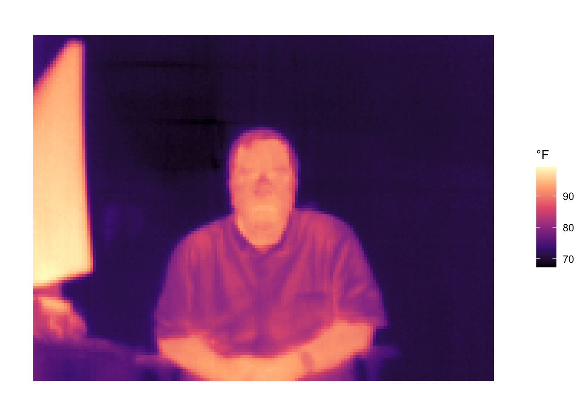

# tcam

Retrieve Radiometric Image Data from and Configure and Control tCam and
tCam-Mini Thermal Imaging Systems

## Description

The tCam and tCam-Mini
(<https://github.com/danjulio/lepton/tree/master/ESP32>) are two cameras
designed around the ESP32 chipset and provide easy access to radiometric
data from Lepton 3.5 sensors. Tools are provided to configure, control,
and receive radiometric data from tCam systems.

## What’s Inside The Tin

The following functions are implemented:

-   `get_image`: Returns a packet with metadata, radiometric (or AGC)
    image data and Lepton telemetry objects.
-   `get_status`: Returns a packet with camera status.
-   `tcam_connect`: Make a socket connection to a tCam device
-   `tidy_radiometric`: Return a tidy data frame of Lepton radiometric
    data retrieved with get_image()

## Installation

``` r
remotes::install_git("https://git.rud.is/hrbrmstr/tcam.git")
```

NOTE: To use the ‘remotes’ install options you will need to have the
[{remotes} package](https://github.com/r-lib/remotes) installed.

## Usage

``` r
library(tcam)
library(ggplot2) # for plotting

# current version
packageVersion("tcam")
## [1] '0.1.0'
```

Open a connection and get the status of the tCam:

``` r
con <- tcam_connect()

get_status(con)
## $status
## $status$Camera
## [1] "tCam-Mini-B3CD"
## 
## $status$Model
## [1] 2
## 
## $status$Version
## [1] "1.3"
## 
## $status$Time
## [1] "2:02:48.364"
## 
## $status$Date
## [1] "1/1/-30"
```

Take a picture and plot it:

``` r
img <- get_image(con)

ggplot(tidy_radiometric(img)) +
  geom_tile(
    aes(x, y, fill = value),
    color = NA
  ) +
  scale_fill_viridis_c(
    name = "°F",
    option = "magma"
  ) +
  coord_fixed() +
  labs(
    x = NULL, y = NULL
  ) +
  theme_minimal() +
  theme(
    axis.text.x.bottom = element_blank(),
    axis.text.y.left = element_blank(),
    panel.grid.major = element_blank(),
    panel.grid.minor = element_blank()
  )
```



Done, so we close the connection.

``` r
close(con)
```

## tcam Metrics

| Lang | # Files |  (%) | LoC |  (%) | Blank lines |  (%) | # Lines |  (%) |
|:-----|--------:|-----:|----:|-----:|------------:|-----:|--------:|-----:|
| R    |       6 | 0.33 |  74 | 0.28 |          18 | 0.21 |      51 | 0.28 |
| Rmd  |       1 | 0.06 |  33 | 0.13 |          23 | 0.27 |      37 | 0.21 |
| YAML |       2 | 0.11 |  23 | 0.09 |           2 | 0.02 |       2 | 0.01 |
| SUM  |       9 | 0.50 | 130 | 0.50 |          43 | 0.50 |      90 | 0.50 |

clock Package Metrics for tcam

## Code of Conduct

Please note that this project is released with a Contributor Code of
Conduct. By participating in this project you agree to abide by its
terms.
